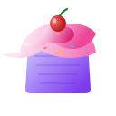
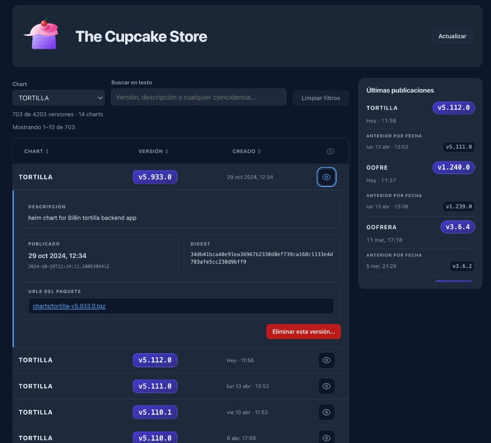

<p align="center">
  
</p>

# The Cupcake Store

UI para [ChartMuseum](https://chartmuseum.com) con **React**, **TypeScript** y **Vite 5**.

## Ejemplo de captura

Tabla de versiones con filtro por chart, detalle expandido (descripción, publicado, digest, URLs) y panel **Últimas publicaciones**.



## Requisitos

- Node.js **20** (`.nvmrc`)

## Comandos

```bash
npm install
npm run dev
```

| Comando | Descripción |
| ------- | ----------- |
| `npm run build` | Compilación para producción |
| `npm run preview` | Vista previa del build (mismo proxy que en dev) |
| `npm run lint` | ESLint |

## Configuración

Copia `.env.example` a `.env` y define al menos `CHARTMUSEUM_BASE_URL`. Usuario y contraseña de Basic Auth van en el `.env`; Vite las aplica en el **proxy** (`/chartmuseum` → tu museo), no en el bundle del navegador.

| Variable | Descripción |
| -------- | ----------- |
| `PORT` | Puerto de dev/preview (opcional; por defecto 5173) |
| `CHARTMUSEUM_BASE_URL` | URL del museo, sin barra final |
| `CHARTMUSEUM_USER` / `CHARTMUSEUM_PASSWORD` | Basic Auth (opcional) |
| `CHARTMUSEUM_REPO_PATH` | Multitenancy: ruta tras `/api` (opcional) |

En producción con solo estáticos hace falta un proxy similar si el museo exige autenticación. Si falla la conexión con `localhost`, prueba `127.0.0.1` en la URL base.
